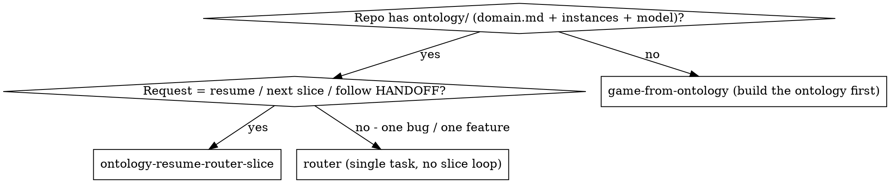
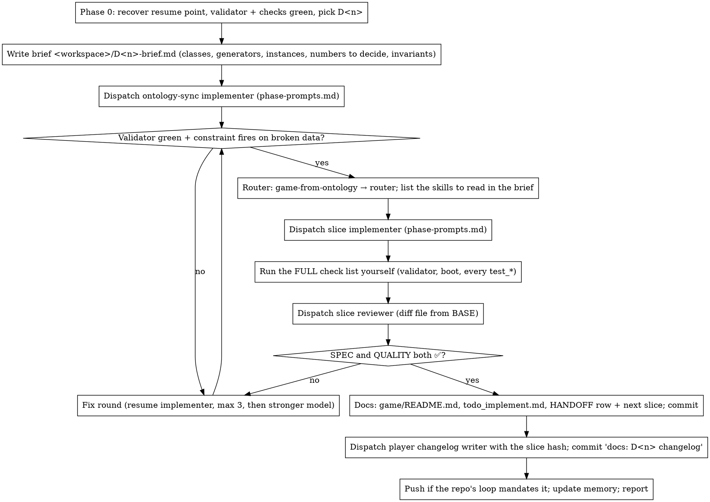

# Ontology Resume → Router → Slice

Resume an ontology-first game project from its handoff, land exactly one slice through the
sync-rule loop (ontology decision → router skills → code → test → docs → player changelog →
commit + push), and leave the next agent a handoff as good as the one you found.

**Core principle:** the repo is the resume point, not your memory. HANDOFF, ledger and `git log`
carry the state; every phase runs in a fresh subagent from a brief file; you coordinate, rule and
review.

**Narration:** one short line between tool calls at most.

**Continuous execution:** the owner asked for the next slice; do not stop for "should I
continue?". Rule on ambiguities (`Ruling: <what> — <why> — <cost if wrong>` in the ledger) and go on.
Stop only for: a destructive operation, a security-sensitive action, a push the repo's own loop does
not already mandate, or a slice so unspecified that every path is a guess.

## When to Use

**REQUIRED SUB-SKILLS:** `game-from-ontology` (chains `ontology` → `router`) at step 2 of every
slice; `superpowers:subagent-driven-development` conventions for dispatch, review and rulings.

## Setup: workspace and ledger

1. `git status` must be clean; if not, stop and report (someone's work is uncommitted).
2. Workspace: `<repo>/.superpowers/slice/<D-id or "next">/` (git-ignored; add the pattern to
   `.gitignore` if absent). It holds the ledger, briefs, reports and the review diff.
3. Ledger `<workspace>/progress.md`, first line `# slice ledger — <repo> — started <date>`. After
   compaction, trust the ledger and `git log` over recollection: a phase with a `Phase <name>:
   complete <hash>` line is done; resume at the first phase without one.

## Phase 0: recover the resume point

Check every file below; the ledger gets one line per file: `found | restored <rev> | rebuilt | absent`.

| File | If missing |
|---|---|
| `docs/HANDOFF.md` | `git log --all -- docs/HANDOFF.md`: restore the last version if any (`git checkout <rev> -- …`), then refresh it. Never in history: rebuild from [handoff-template.md](handoff-template.md) using `git log`, `ontology/README.md` status lines, `domain.md §7` D-lines and `game/README.md`. |
| `docs/ROADMAP/todo_implement.md` | restore or create with the header from the template and one section per shipped slice, seeded from every `ponytail:` comment in `game/` (`grep -rn "ponytail:"`). |
| `docs/ROADMAP/todo_decide.md` | restore or create; one `[x] D<n>` per §7 entry of `domain.md`. |
| `ontology/README.md` status log | append a dated line per D-entry that lacks one. |
| `docs/changelogs/pre-v1/` | `mkdir -p`; no back-filling of older slices unless asked. |
| validator (`model.<ext>` validate, `validate.<ext>` runner) | none → the ontology phase adds one before anything else; the slice does not start on an unvalidated ontology. |
| `game/README.md` checks list | rebuild from `game/**/test_*` files. |

Then run the validator and the full check list. Red → that fix is the slice (a "repair" slice with
its own D-entry only if a decision is involved). Green → pick the next slice by the first rule that applies, no other tie-break:
1. HANDOFF "Next slice" item 1, unless it is already shipped (a `domain.md §7` D-entry or a
   `game/README.md` "done" marker covers it — a restored HANDOFF can be many slices stale).
2. Else the first "next …" hint in the `game/README.md` folder table, in §3 order.
3. Else the first §3 section of `domain.md` with no `game/` folder.
Assign `D<n>` = last §7 number + 1. Write the choice, the rule number and the evidence to the ledger.

## The slice loop

**The brief is the requirements.** Write it yourself from the ontology (the §3 class rows, §6
generator, instance files, the alpha/source prose to honour, the numbers the sources never gave)
before any dispatch; implementers read the brief, never the session. Record `BASE = git rev-parse
HEAD` before each dispatch; the review diff is `git diff BASE..HEAD` written to a file.

**Three commits, in this order, every slice:** `ontology: D<n> …` → `<Slice> slice: D<n> …` →
`docs: D<n> changelog + HANDOFF row hash`. The changelog file needs the slice hash in its name, so
it is written only after the slice commit exists; the HANDOFF table row gets the same hash in the
same docs commit. Commit messages end with the session's attribution trailer.

**Push** when HANDOFF's loop says the owner wants a push per slice (record the line you relied on
in the ledger); otherwise leave the branch and say so.

**Player changelog:** `docs/changelogs/pre-v1/<yyyymmddhhmmss>_D<n>_<slice hash>.md`, written for
the game's page: what players can now do, grouped by what they touch, one "Coming next" line. No
file names, ids, commit talk or deferred lists — those live in the commit message, HANDOFF and
`todo_implement.md`.

## Model Selection

Name the model in every dispatch. Ontology sync and the changelog: cheap-to-mid. Slice implementer:
standard; most capable when it spans three or more engine files or a new runtime. Reviewer: scaled
to the diff. Fix rounds 4–5: one tier above the stuck implementer.

## Quick Reference

| Need | Where |
|---|---|
| Resume point | `docs/HANDOFF.md` → `git log --oneline -8` → `docs/ROADMAP/todo_implement.md` |
| Decision numbers | `ontology/instances/generators.json#design.<topic>` + `domain.md §7 D<n>` |
| Drift guard | `c-<topic>-config` in the model's `validate()`; prove it fires |
| Checks | `game/README.md` "Checks" block, every line, under `timeout` |
| Dispatch text | [phase-prompts.md](phase-prompts.md) |
| HANDOFF shape | [handoff-template.md](handoff-template.md) |
| Cuts | `ponytail:` comment in code **and** a `todo_implement.md` line, both or neither |

## Rationalizations that end a slice half-done

| Excuse | Reality |
|---|---|
| "The numbers are obvious, code first, ontology after" | Code-first is drift by definition; the D-entry and validator are the slice's contract. Ontology commit first. |
| "I'll fold the test into an existing suite" | One `test_<slice>` per slice, listed in `game/README.md`; folded tests vanish from the checks list. |
| "The new test passes, that's enough" | Run the whole check list; slices break neighbours (input is global, shared resources, shared shapes). |
| "Commit only when the owner asks" | The owner asked for the slice and its changelog; the changelog needs the slice hash. Three commits. |
| "HANDOFF is gone, I'll infer the next slice from vibes" | Restore from history first; rebuild from the template second; the choice and its reason go in the ledger. |
| "Push is outward-facing, skip it" | Follow the repo's loop line; if it mandates a push, push; if not, don't. Record which. |
| "Reviewer is overkill for a small slice" | Every slice gets a reviewer with a diff file; skipping review is how ontology drift ships. |
| "I remember where I was" | After compaction you don't. Ledger and `git log` decide. |
| "Missions is the only untouched section, so it comes first" | The next-slice rules are ordered; an unstarted section is rule 3, after HANDOFF and the README hints. Invented tie-breaks go in the ledger as a ruling only when rules 1–3 all fail. |

## Red Flags — STOP and go back to the loop

- Any engine file edited before the `ontology:` commit exists
- A `design.*` key with no validator rule, or a rule you never saw fail
- A changelog with a file name, a constraint id or a commit hash in its body
- A HANDOFF table row without the slice hash, or a "Next slice" list unchanged from last time
- Two implementers running at once
- A `ponytail:` comment with no matching `todo_implement.md` line

## Common Mistakes

- **Dispatching from session history** instead of a brief file: the implementer redoes your
  exploration and misses the exact ids. Write the brief.
- **Wrong test scaffolding** (engine gotchas: `@onready` null in `_init`, bodies born at the
  origin carrying others, global `Input` hitting every player): copy the newest `test_*` file as the
  starting point and reuse its helpers.
- **Memory files as the resume point**: they are a mirror of HANDOFF; when they disagree, HANDOFF
  wins and memory is updated last.
